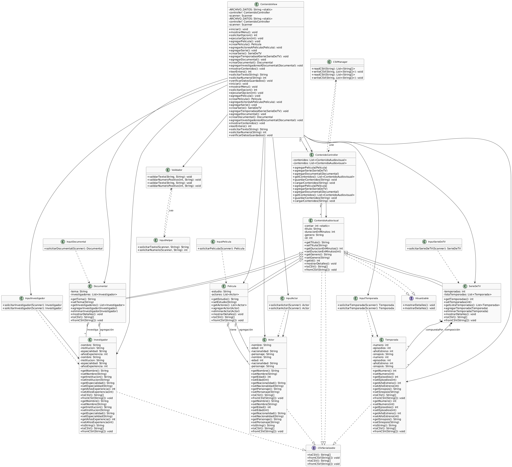

# Proyecto: Sistema de Gestión de Contenidos Audiovisuales

## Autor
- Nombre: Carlos Marca
- Estudiante de segundo ciclo de la carrera de Ingeniería de Software
- **Universidad Politécnica Salesiana**

## Resumen
Este proyecto es una aplicación en Java para la gestión de contenidos audiovisuales como películas, series de TV y documentales. Permite agregar, visualizar y guardar información de cada contenido, incluyendo actores, temporadas e investigadores, utilizando archivos CSV para la persistencia de datos. El sistema está diseñado siguiendo principios de POO y buenas prácticas de diseño.

---
## Estructura de Carpetas
```
poo_u4/
├── img/
│   └── diagrama_de_clases.png
├── src/
│   ├── controller/
│   │   └── ContenidoController.java
│   ├── main/
│   │   └── Main.java   
│   ├── model/
│   │   ├── Actor.java
│   │   ├── ContenidoAudiovisual.java
│   │   ├── CSVSerializable.java
│   │   ├── Documental.java
│   │   ├── Investigador.java
│   │   ├── Pelicula.java
│   │   ├── SerieDeTV.java
│   │   ├── Temporada.java
│   │   └── Visualizable.java
│   ├── utils/
│   │   ├── CSVManager.java
│   │   ├── InputActor.java
│   │   ├── InputDocumental.java
│   │   ├── InputHelper.java
│   │   ├── InputInvestigador.java
│   │   ├── InputPelicula.java
│   │   ├── InputSerieDeTV.java
│   │   ├── InputTemporada.java
│   │   └── Validador.java
│   └── view/
│       └── ContenidoView.java
├── test/
│   ├── controller/
│   │   └── ContenidoControllerTest.java
│   └── model/
│       ├── DocumentalTest.java
│       ├── PeliculaTest.java
│       └── SerieDeTVTest.java
```
---

## Características
- Gestión de películas, series y documentales.
- Serialización y deserialización de datos en formato CSV.
- Agregación de actores, temporadas e investigadores.
- Validación de datos de entrada.
- Diagrama de clases incluido.
- Separación por capas: modelo, vista, controlador y utilidades.
- Pruebas unitarias básicas.

---
## Clases y Relaciones

A continuación se muestra un resumen de las clases principales y sus relaciones:


### Clases principales
- **ContenidoAudiovisual**: Clase abstracta base para todos los contenidos audiovisuales. Hereda de las interfaces `CSVSerializable` y `Visualizable`.
- **Pelicula**: Hereda de `ContenidoAudiovisual`. Agregación de una lista de `Actor`.
- **SerieDeTV**: Hereda de `ContenidoAudiovisual`. Composición de una lista de `Temporada`.
- **Documental**: Hereda de `ContenidoAudiovisual`. Agregación de una lista de `Investigador`.
- **Actor**: Representa un actor, implementa `CSVSerializable`.
- **Temporada**: Representa una temporada de serie, implementa `CSVSerializable`.
- **Investigador**: Representa un investigador, implementa `CSVSerializable`.

### Interfaces
- **CSVSerializable**: Interfaz para serialización/deserialización CSV.
- **Visualizable**: Interfaz para mostrar detalles en consola.

### Controlador y Vista
- **ContenidoController**: Controlador principal, gestiona la lista de contenidos y la persistencia.
- **ContenidoView**: Vista principal, gestiona la interacción con el usuario.

### Clases utilitarias
- **CSVManager**: Manejo de archivos CSV.
- **Validador**: Validación de datos de entrada.
- **InputActor**: Entrada de actores.
- **InputPelicula**: Entrada de películas.
- **InputSerieDeTV**: Entrada de series de TV.
- **InputTemporada**: Entrada de temporadas.
- **InputInvestigador**: Entrada de investigadores.
- **InputDocumental**: Entrada de documentales.
- **InputHelper**: Entrada y validación genérica.

### Relaciones
  - `Pelicula` tiene una lista de `Actor` (agregación).
  - `SerieDeTV` tiene una lista de `Temporada` (composición).
  - `Documental` tiene una lista de `Investigador` (agregación).
  - Las clases `ContenidoAudiovisual`, `Actor`, `Temporada` e `Investigador` implementan la interfaz `CSVSerializable` para la serialización/deserialización en CSV.
  - La clase `ContenidoAudiovisual` implementa además la interfaz `Visualizable` para mostrar detalles en consola.
## Diagrama de Clases
El archivo `src/img/diagrama_de_clases.png` contiene el diagrama de clases del proyecto en formato PNG.

A continuación se muestra una vista previa del diagrama de clases generado para este sistema:



---

## Instrucciones para Clonar y Ejecutar el Proyecto
1. Abre una terminal o consola de comandos.
2. Clona el repositorio ejecutando:
   ```bash
   git clone https://github.com/cmarca26/poo_u4.git
   cd poo_u4
   ```
3. Abre el proyecto en tu IDE favorito y compílalo como un proyecto Java estándar.
4. Ejecuta la clase principal `Main` para iniciar el simulador.
5. (Opcional) Ejecuta las clases de prueba ubicadas en la carpeta `test` para validar el funcionamiento.
---

## Características Avanzadas
- El proceso de entrada y resultados se registra y puede ser serializado para su posterior recuperación.
- Validación de datos de entrada mediante la clase `Validador`.
- Serialización y deserialización de contenidos en formato CSV usando la interfaz `CSVSerializable` y la clase `CSVManager`.
- Separación por capas: modelo, vista, controlador y utilidades.
- Pruebas unitarias básicas incluidas en la carpeta `test/`.
- El diagrama de clases actualizado facilita la comprensión y extensión del sistema.

---

## Notas Adicionales
- El proyecto es educativo y puede ser extendido para agregar más funcionalidades.
- El sistema está diseñado para facilitar la gestión y visualización de contenidos audiovisuales.
- El flujo de interacción y persistencia está automatizado para el usuario.
- El diagrama de clases y la estructura modular permiten una fácil ampliación y mantenimiento.